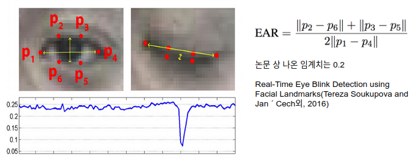
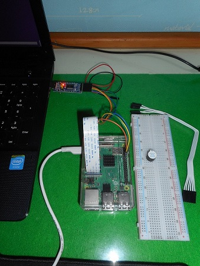

# Drowsing detection

* Real-Time Eye Blink Detection using Facial Landmarks(Tereza Soukupova and Jan ´ Cech외, 2016)의 방법을 따름

# 사고예방

* 100km/h 속도를 갖는 차량이 안전거리 100m를 유지하고 있다고 가정

> 고속도로를 달리는 차량을 가정하면 56m의 제동거리가 필요하므로 운전자는 44m의 여유가 있다.  
> 1초에 27m를 이동하므로 시간으로 환산하면 운전자는 1.63초의 여유가 있는 셈이다. 
> 반응속도 0.7초를 빼면 약 0.9초의 시간이 남는다.  

눈을 감지않지 않은 상태를 not drowsing, 눈을 감은 상태를 drowsing 상태로 판단하고
opencv 객체 cap을 30fps로 설정했으므로 0.9초에 해당하는 27프레임동안 drowsing이 지속되면 sleeping으로 판단한다.
drowsing상태에서는 짧은 비프음, sleeping상태에서는 not drowsing상태가 될 때까지 비프음이 지속되게 한다.

# 라즈베리 파이

사용자에게 가는 알림은 라즈베리 파이의 GPIO 제어로 구현했다.  

